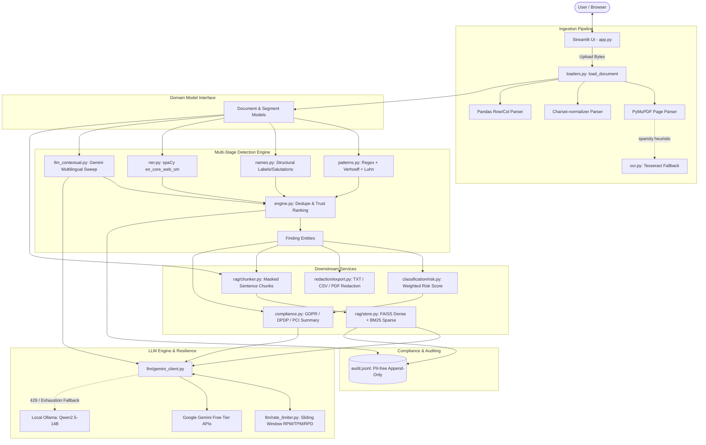

# System Architecture & Core Data Contracts

## 1. Executive Summary

The **Sensitive Data Detection & Compliance Assistant** is an enterprise-grade document intelligence platform built with Python and Streamlit. It is engineered to ingest heterogeneous documents (PDF, TXT, CSV), identify personally identifiable information (PII) and confidential business records, evaluate composite compliance risks under international and regional regulatory frameworks (GDPR, India DPDP Act 2023, PCI-DSS), produce sanitized exports with zero PII leakage, and enable grounded conversational question-answering via Retrieval-Augmented Generation (RAG).

A defining engineering constraint of the project is operation on the **Google Gemini free tier** without service interruptions, achieved through an intelligent rate-limit-aware model rotation engine paired with an optional local LLM fallback (Ollama).

---

## 2. High-Level Architectural Topology

The system enforces a clean separation of concerns:
- **Presentation Layer**: Thin Streamlit user interface (`app.py`) managing session state, document previews, findings tables, risk charts, and chat interfaces.
- **Orchestration Layer**: Coordinates detection across deterministic and probabilistic detectors (`src/detection/engine.py`).
- **Core Domain Modules**:
  - `src/ingestion`: Multi-format parsing with PyMuPDF, charset-normalizer, pandas, and Tesseract OCR fallback.
  - `src/detection`: Checksum-verified regex patterns, structural name parser, spaCy NER, and Gemini contextual verification.
  - `src/classification`: Deterministic explainable risk scoring.
  - `src/redaction`: Masking primitives, occurrence-complete redaction, and format-specific sanitization.
  - `src/rag`: Masked chunking, local MiniLM dense embeddings, BM25 sparse lexical indexing, Reciprocal Rank Fusion (RRF), optional cross-encoder reranking, and grounded Q&A.
  - `src/llm`: Token/request sliding-window rate limiting, priority rotation, exponential backoff, and local Ollama failover.
  - `src/compliance`: Regulatory observation and remediation synthesis.
  - `src/audit`: Append-only, PII-free JSONL audit ledger.
- **Data Contracts**: Single source of truth in `src/models.py`.
- **Configuration**: Unified environment-backed settings in `src/config.py`.



---

## 3. Core Data Contracts (`src/models.py`)

All modules communicate exclusively via immutable and dataclass structures defined in `src/models.py`. No internal module state is exposed directly across layer boundaries.

### 3.1 Entity Vocabulary (`EntityType`)
```python
class EntityType(StrEnum):
    AADHAAR = "AADHAAR"
    VID = "VID"                # Aadhaar Virtual ID (16-digit)
    PAN = "PAN"                # Indian Permanent Account Number
    EMAIL = "EMAIL"
    PHONE = "PHONE"
    DOB = "DOB"                # Date of birth
    CREDIT_CARD = "CREDIT_CARD"
    BANK_ACCOUNT = "BANK_ACCOUNT"
    IFSC = "IFSC"              # Indian Financial System Code
    API_KEY = "API_KEY"        # Cloud, AI, and Git tokens
    PASSWORD = "PASSWORD"      # Assigned secrets & credentials
    EMPLOYEE_ID = "EMPLOYEE_ID"
    CONFIDENTIAL_INFO = "CONFIDENTIAL_INFO"  # NDAs, financial data, trade secrets
    PERSON = "PERSON"
    ORG = "ORG"
    LOCATION = "LOCATION"
```

### 3.2 Document & Segment Representation
- `Document`: Represents an ingested file. Contains a deterministic `doc_id` (`sha256(raw_bytes)[:16]`), extracted normalized text, list of `Segment` objects, total page count, OCR flag, count of unreadable/empty pages, and file metadata.
- `Segment`: Positional unit of extracted text preserving physical geometry:
  - `page`: 1-based page index for PDFs.
  - `line`: 1-based line index for text and tables.
  - `column`: Header name for CSV columns.
  - `char_offset`: Starting index of the segment relative to `Document.text`.

### 3.3 Findings & Provenance
- `Finding`: A single detected instance of sensitive data.
  - `entity_type`: Canonical `EntityType`.
  - `value_masked`: Obfuscated representation (e.g., `****1234`, `a***@d***.com`).
  - `value_raw`: Kept in memory only; **never saved to logs or vector indices**.
  - `start`, `end`: Exact character offsets in `Document.text`.
  - `detector`: Provenance identifier (`verhoeff`, `luhn`, `regex`, `spacy`, `llm`, `name-label`, etc.).
  - `confidence`: Calibrated score (0.0 to 1.0).
  - `page`, `line`, `column`: Physical location coordinates.
  - `rationale`: Contextual justification from LLM passes.

### 3.4 Risk & Downstream Reporting
- `RiskContributor`: Individual driver of document risk, mapping entity type, occurrence count, severity weight, and net contribution.
- `RiskReport`: Document risk rating (`Low`, `Medium`, `High`), aggregated numerical score, breakdown of contributors, and summary explanation.
- `Chunk`: Pre-redacted document slice for RAG ingestion.
- `Citation`: Retrievable evidence linking an LLM answer back to exact document coordinates (`page`, `line`, `snippet`).
- `QAResult`: Response containing generated answer, citations, groundedness validation flag, and serving model metadata.
- `SummaryResult`: Compliance overview report with model attribution.

---

## 4. Central Configuration (`src/config.py`)

All configuration is managed by Pydantic Settings (`pydantic-settings`), providing type safety, default validation, and override support from environment variables (prefixed with `SDA_`), `.env` files, or Streamlit Cloud secrets.

### Key Architectural Configurations
| Config Variable | Default | Description |
|---|---|---|
| `GEMINI_API_KEY` | `""` | Primary API authentication key (unprefixed alias). |
| `model_registry` | 5 Models | Ordered fallback sequence with free-tier RPM/TPD/TPM quotas. |
| `enable_ollama` | `True` | Fallback to local Ollama server if cloud quotas are exhausted. |
| `ollama_model` | `"qwen2.5:14b"` | Recommended local model for JSON adherence & extraction. |
| `local_only_mode` | `False` | Air-gapped privacy switch: prevents cloud transmissions. |
| `enable_ner` | `True` | Toggle spaCy named entity recognition. |
| `enable_llm_contextual` | `True` | Toggle contextual LLM sweep. |
| `rag_min_score` | `0.30` | Minimum cosine similarity floor for grounding RAG answers. |
| `enable_hybrid_search` | `True` | Combine dense FAISS embeddings with BM25 via RRF. |
| `enable_reranker` | `False` | Opt-in cross-encoder reranking (auto-upgrades on CUDA). |
| `redaction_style` | `"mask"` | Default export masking style (`"mask"` vs `"placeholder"`). |
| `severity_weights` | Dict | Weights per entity (Aadhaar=10, Card=10, Key=10, PAN=8, etc.). |

---

## 5. Architectural Quality Attributes & Guarantees

1. **Privacy-by-Design**:
   - `Finding.value_raw` is kept transiently in memory for redaction execution or user-initiated reveal.
   - Vector chunks are redacted *before* embedding generation; raw PII never enters the FAISS index.
   - Audit logs store only entity counts, execution latency, and sha256 hashes of queries.
2. **Determinism vs. Probabilism**:
   - High-consequence structured identifiers (Aadhaar, Credit Cards, PAN, IFSC) are validated via algorithmic checksums and regex.
   - LLMs are reserved for contextual comprehension, multilingual place/name discovery, and synthesis.
3. **Resilience & Self-Healing**:
   - Model rotation absorbs 429 quota exhaustion gracefully.
   - Unreadable inputs produce explicit safety caveats rather than false-negative "clean" compliance reports.
