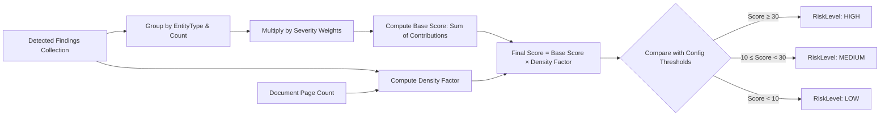

# Risk Classification & Compliance Engine

## 1. Overview & Regulatory Context

The risk and compliance subsystems (`src/classification/risk.py` and `src/compliance.py`) translate raw technical findings into actionable compliance intelligence. Enterprise security teams require:
1. **Explainable Risk Scoring**: Auditable mathematical risk metrics rather than opaque AI classifications.
2. **Framework Mapping**: Direct correlation between detected entity categories and international statutory obligations (EU GDPR, India DPDP Act 2023, and PCI-DSS v4.0).
3. **Deterministic Fault-Tolerance**: Zero-downtime compliance summaries that function even when LLM quotas are exhausted or systems are air-gapped.

---

## 2. Explainable Weighted Risk Scoring Model

The risk calculation is deterministic, transparent, and parameter-driven via `src/config.py`.



### 2.1 Formulation
1. **Base Score Calculation**:
   $$\text{Base Score} = \sum_{t \in \text{EntityTypes}} \Big( \text{Count}(t) \times \text{SeverityWeight}(t) \Big)$$

2. **Density Factor Adjustment**:
   $$\text{Concentration} = \frac{\text{Total Findings}}{\max(1, \text{Page Count})}$$
   $$\text{Density Factor} = 1.0 + 0.1 \times \max(0.0, \text{Concentration} - 3.0)$$
   *Rationale (Decision D19)*: A 1-page document with 20 PII elements poses a higher relative risk density than a 100-page document with 20 dispersed occurrences. The density multiplier kicks in only when concentration exceeds 3 findings per page, preventing distortion on small golden benchmarks.

3. **Composite Document Score**:
   $$\text{Score} = \text{round}(\text{Base Score} \times \text{Density Factor}, 2)$$

### 2.2 Severity Weights Matrix
Configured centrally in `src/config.py` (`DEFAULT_SEVERITY_WEIGHTS`):
| Category | Weight | Regulatory & Impact Justification |
|---|---|---|
| `AADHAAR` | **10** | Critical national biometric/demographic ID (DPDP Act). |
| `VID` | **10** | Aadhaar Virtual ID; legally identical risk. |
| `CREDIT_CARD` | **10** | Financial cardholder data; high fraud potential (PCI-DSS). |
| `API_KEY` | **10** | Infrastructure credential; leads to system compromise. |
| `PASSWORD` | **10** | Authentication secret; immediate unauthorized access. |
| `BANK_ACCOUNT` | **9** | Direct financial PII; banking secrecy regulations. |
| `PAN` | **8** | Indian national tax identity; identity theft risk. |
| `IFSC` | **7** | Routing identifier; enables financial transaction routing. |
| `DOB` | **6** | Personal identifier; enables demographic triangulation. |
| `CONFIDENTIAL_INFO`| **6** | Trade secrets, proprietary formulas, M&A, NDAs. |
| `PHONE` | **4** | Direct contact identifier (GDPR/DPDP). |
| `EMAIL` | **4** | Direct electronic identifier (GDPR/DPDP). |
| `EMPLOYEE_ID` | **4** | Internal organizational identifier. |
| `PERSON` | **1** | Broad named entity. |
| `ORG` | **1** | Corporate / institutional mention. |
| `LOCATION` | **1** | Geographic place name. |

### 2.3 Risk Bands
- **HIGH ($\ge 30$)**: Triggered by $\ge 3$ critical IDs (e.g., 3 Aadhaar or 3 Credit Cards), or a high density of financial and personal data. Requires immediate redaction and security escalation.
- **MEDIUM ($10 \text{ to } 29.9$)**: Triggered by a single Aadhaar, Credit Card, or API key, or multiple emails/phones. Requires sanitization before external sharing.
- **LOW ($< 10$)**: Isolated low-weight personal mentions (e.g., 1–2 names or emails).

---

## 3. Compliance Summary Engine (`src/compliance.py`)

The compliance engine synthesizes a formal compliance report evaluating the document against major regulatory statutes.

### 3.1 PII-Free Grounded Brief Construction
To prevent accidental data exfiltration to external LLM endpoints, the LLM is **never passed raw document text or sensitive values**. Instead, `_build_brief()` compiles an aggregated, token-minimized brief:
```text
Overall risk: High (score 34.0).
Detected sensitive data types and counts:
- AADHAAR: 2
- CREDIT_CARD: 1
- PAN: 1
- EMAIL: 2
```

### 3.2 Dual-Track Generation Architecture
The system supports two execution paths:
1. **AI Synthesis (Cloud Gemini or Local Ollama)**:
   - When available, Gemini generates an executive Markdown report structured into:
     - **Compliance Observations**: Relevant statutory articles and violations.
     - **Security Risks**: Threat vectors (credential abuse, fraud, phishing).
     - **Recommended Remediation**: Technical steps for access control and sanitization.
   - The result records `model_used` (e.g. `gemini-3.5-flash`) for audit provenance.
2. **Deterministic Template Fallback (`_template_summary`)**:
   - If the API key is absent or all models in the rotation are exhausted (429/quota caps), the engine automatically falls back to an offline rule-based matrix.
   - Zero crash guarantee: the user always receives a complete, structured compliance report.

### 3.3 Statutory Cross-Reference Matrix
| Entity Type | Applicable Regulation | Remediation Requirement |
|---|---|---|
| `AADHAAR` / `VID` | India DPDP Act 2023 | Mask/tokenize UID; restrict access; avoid persistent storage. |
| `PAN` | India DPDP Act 2023 | Encrypt PAN at rest; restrict processing to authorized tax purposes. |
| `CREDIT_CARD` | PCI-DSS v4.0 | Never store PAN in clear text; scope PCI CDE; tokenize. |
| `BANK_ACCOUNT` | PCI-DSS / DPDP | Enforce least privilege; encrypt bank details in transit and rest. |
| `IFSC` | India DPDP Act 2023 | Redact bank routing codes from public and cross-border transfers. |
| `API_KEY` / `PASSWORD`| Security Best Practice | Immediate key rotation; migrate to AWS Secrets Manager / Vault. |
| `EMAIL` / `PHONE` | EU GDPR / DPDP | Enforce data minimization; support right to erasure (Article 17). |
| `CONFIDENTIAL_INFO`| Commercial NDA / IP | Label confidential; apply role-based access control (RBAC). |
